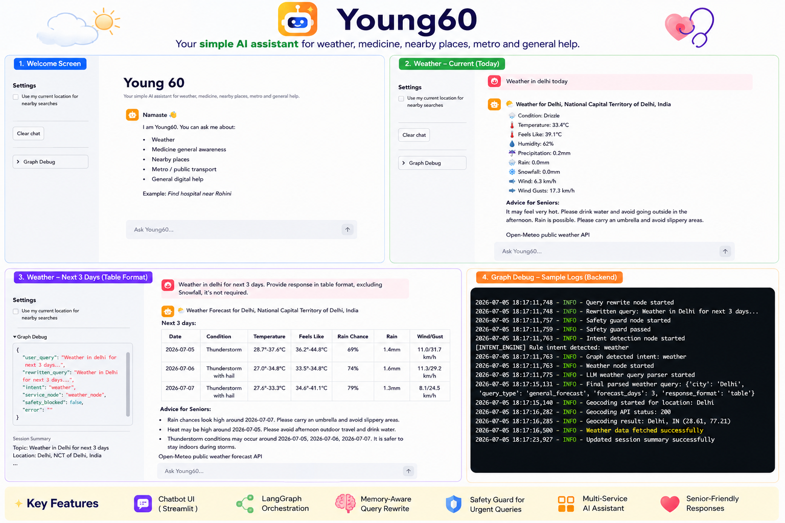

# Young60

Young60 is an AI-powered assistant for senior citizens.

It helps with:

- Weather queries
- Medicine general awareness
- Nearby places
- Metro / public transport queries
- General digital help
- Safety guidance for urgent or sensitive questions

## Architecture

```text
User Chat
  ↓
Streamlit Chat UI
  ↓
LangGraph Orchestration
  ↓
Memory / Query Rewrite / Safety Guard
  ↓
Intent Detection
  ↓
Service Nodes
  ↓
Final Senior-Friendly Response
```

## Main Components

- `app/app.py` - Streamlit chatbot UI
- `graph/young60_graph.py` - LangGraph orchestration
- `graph/state.py` - Shared graph state
- `core/intent_engine.py` - Intent detection
- `services/` - Domain services
  - Weather
  - Medicine
  - Nearby places
  - Metro / public transport
  - General help

## Documentation

- [Architecture](docs/ARCHITECTURE.md)
- [Learning Notes](docs/LEARNINGS.md)


## Features

- Chatbot-style Streamlit interface
- LangGraph-based orchestration
- Memory-aware query rewriting
- Session summary memory
- Safety guard for urgent and sensitive queries
- Conditional routing to service nodes
- Senior-friendly response formatting
- Sidebar debug trace for development

## Project Preview



## Sample Prompts

You can try:

- Weather in Delhi today
- Weather in Delhi for next 3 days in table format
- Dolo 650 side effects
- Find hospital near Rohini
- Find pharmacy near me
- How to use WhatsApp video call?
- Can I share OTP with bank agent?

## Setup

Install dependencies:

```bash
pip install -r requirements.txt
```

Create a `.env` file using `.env.example` and add your API keys.

Run the app:

```bash
streamlit run app/app.py
```

## Environment Variables

Example:

```env
OPENAI_API_KEY=your_openai_api_key_here
OPENAI_MODEL=gpt-5-nano

GOOGLE_MAPS_API_KEY=your_google_maps_api_key_here

DEFAULT_NEARBY_LOCATION=Rohini, Delhi, India
NEARBY_DEFAULT_RADIUS_METERS=3000
NEARBY_MAX_RESULTS=5
YOUNG60_CONTACT=young60-learning-app
```

## Learning Outcomes

While building Young60, I learned how to design a multi-service AI assistant using LangGraph, Streamlit, external APIs, memory-aware query rewriting, and safety guardrails.

Detailed learning notes are available here:

[Learning Notes](docs/LEARNINGS.md)

## Current Limitations

- Nearby place results depend on available OpenStreetMap data.
- Metro/public transport output is currently MVP-level and needs refinement.
- Persistent user memory is not implemented yet.
- Voice input/output is not implemented yet.
- This project is currently designed as a local/portfolio application.

## Safety Note

Young60 provides general guidance only. It does not replace doctors, emergency services, banks, government authorities, or professional advice.

## Repository Status

This project is maintained as a portfolio project and will be improved iteratively with better nearby search, metro routing, persistent memory, and deployment support.