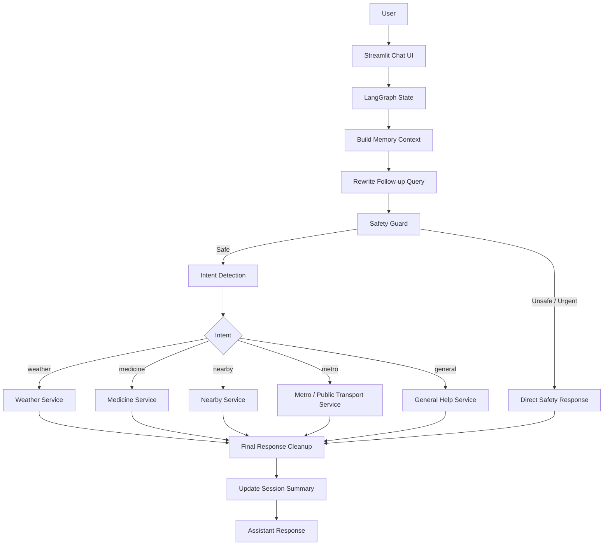

# Young60 - Architecture

Young60 is a chatbot-style AI assistant designed for senior citizens.  
The goal is to provide simple, safe, and practical help across multiple daily-use services.

## High-Level Architecture

```text
User
  ↓
Streamlit Chat UI
  ↓
LangGraph Orchestration
  ↓
Memory Context
  ↓
Query Rewrite
  ↓
Safety Guard
  ↓
Intent Detection
  ↓
Conditional Service Node
  ↓
Final Response Cleanup
  ↓
Session Summary Update
  ↓
Assistant Response
```

## Architecture Diagram



## Main Components

| Component | File | Purpose |
|---|---|---|
| Streamlit UI | `app/app.py` | Chat interface, sidebar settings, location option, graph debug display |
| LangGraph Orchestration | `graph/young60_graph.py` | Controls memory, rewrite, safety, routing, final response, and summary update |
| Graph State | `graph/state.py` | Shared state object passed between graph nodes |
| Intent Engine | `core/intent_engine.py` | Detects user intent such as weather, medicine, nearby, metro, or general |
| Service Logger | `core/service_logger.py` | Common logging utility for all services |
| Weather Service | `services/weather_service.py` | Handles weather queries using API-backed data and LLM formatting |
| Medicine Service | `services/medicine_service.py` | Handles general medicine awareness with safety notes |
| Nearby Service | `services/nearby_service.py` | Finds nearby places using map/OpenStreetMap-based data |
| Metro Service | `services/metro_service.py` | Handles metro/public transport route queries |
| General Service | `services/general_service.py` | Handles digital help, explanations, message drafting, and general questions |

## LangGraph Flow

### 1. Build Memory Context

The graph first reads recent chat messages and the current session summary.

This helps the assistant understand follow-up questions.

Example:

```text
User: Weather in Jaipur
User: What about tomorrow?
```

The memory context helps the graph understand that “tomorrow” refers to Jaipur weather.

---

### 2. Query Rewrite

The query rewrite node converts follow-up questions into standalone queries.

Example:

```text
Original query:
Weather in Jaipur

Rewritten query:
Weather in Jaipur for next 3 days
```

This makes downstream services simpler because every service receives a clearer query.

---

### 3. Safety Guard

The safety guard checks urgent or sensitive topics before normal routing.

Examples of high-risk cases:

- Chest pain
- Breathing difficulty
- Medicine overdose
- OTP sharing
- UPI PIN / ATM PIN / CVV / password sharing

If the query is urgent or risky, the graph returns a direct safety response instead of calling normal services.

---

### 4. Intent Detection

After safety checks, the intent engine classifies the query.

Supported intents:

| Intent | Example |
|---|---|
| `weather` | Weather in Jaipur |
| `medicine` | Dolo 650 side effects |
| `nearby` | Find hospital near Rohini |
| `metro` | Metro route from Rohini West to AIIMS |
| `general` | How to use WhatsApp video call? |

---

### 5. Conditional Service Routing

LangGraph routes the query to the correct service node based on intent.

```text
Intent = weather  → weather_node
Intent = medicine → medicine_node
Intent = nearby   → nearby_node
Intent = metro    → metro_node
Intent = general  → general_node
```

Each service node calls one domain-specific service.

---

### 6. Final Response Cleanup

Before showing the answer to the user, the graph cleans the response.

It removes internal/debug/source lines and handles blank responses safely.

---

### 7. Session Summary Update

After every response, the graph updates a short session summary.

This helps the assistant remember the current topic during the session.

Example summary:

```text
User asked about weather in Jaipur. Latest context is Jaipur weather.
```

This memory is session-only and not permanently stored.

## Service Design Pattern

Most services follow this pattern:

```text
User Query
  ↓
LLM Parser
  ↓
Structured JSON
  ↓
API / Data Lookup
  ↓
Code Builds Factual Base Answer
  ↓
LLM Formats Senior-Friendly Response
```

The LLM is used mainly for:

- Understanding natural language
- Extracting structured information
- Rewriting follow-up queries
- Formatting final answers

The LLM is not treated as the only source of truth for factual data.

## Safety Design

Young60 is designed for senior citizens, so safety is part of the architecture.

### Medical Safety

Young60 does not replace a doctor.  
For urgent symptoms like chest pain or breathing difficulty, it tells the user to seek immediate medical help.

### Medicine Safety

Young60 provides general medicine awareness only.  
It does not provide personal dosage, prescription changes, or emergency treatment.

### Banking Safety

Young60 warns users not to share:

- OTP
- UPI PIN
- ATM PIN
- CVV
- Password
- Screen-sharing access

## Memory Design

Young60 currently uses session memory.

| Memory Type | Current Status | Purpose |
|---|---|---|
| Chat history | Available | Shows previous conversation |
| Recent message memory | Available | Helps rewrite follow-ups |
| Session summary | Available | Maintains short context |
| Persistent memory | Future improvement | Store safe user preferences with consent |

## Current Limitations

- Nearby place accuracy depends on available map data.
- Metro/public transport output needs further refinement.
- Persistent user memory is not implemented yet.
- Voice input/output is not implemented yet.
- The app is currently a local/portfolio project unless deployed.

## Future Improvements

- Add persistent memory with SQLite
- Improve nearby service accuracy
- Improve metro/public transport route quality
- Add voice input and voice output
- Add Hindi/Hinglish support across all services
- Add senior-friendly large button mode
- Add emergency contacts feature
- Add authentication
- Deploy on Streamlit Cloud
- Add automated tests

## Summary

Young60 combines:

- Streamlit chatbot UI
- LangGraph orchestration
- Memory-aware query rewriting
- Safety guardrails
- Conditional service routing
- External APIs/data sources
- Senior-friendly response formatting

This architecture turns a simple chatbot into a multi-service AI assistant with agentic flow and safety-first design.